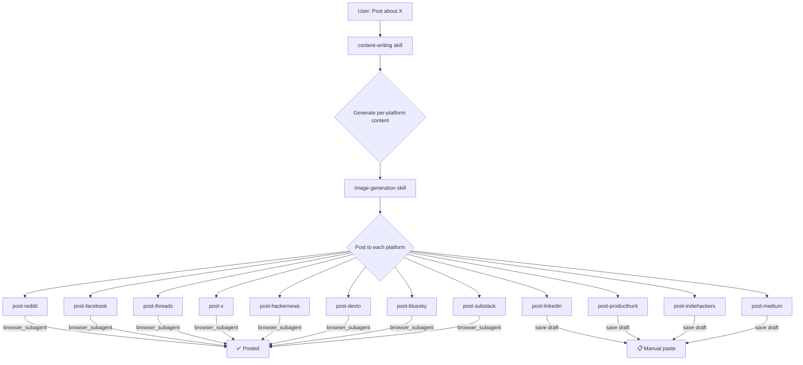

# 📢 Social Posting Skills

**Curated AI agent skills for posting content across 12 social media platforms.**

Built for [Antigravity IDE](https://blog.google/technology/google-deepmind/antigravity/), [Claude Code](https://docs.anthropic.com/en/docs/claude-code), [Gemini CLI](https://github.com/google-gemini/gemini-cli), and any AI coding assistant that supports `.agents/skills/` or `.gemini/skills/`.

---

## ✨ What This Does

Drop these skills into your project and your AI agent can:

- 📝 **Generate platform-optimized content** from a single topic
- 🖼️ **Create images** sized for each platform
- 🤖 **Auto-post via browser automation** (Playwright/browser_subagent)
- 📋 **Save drafts** for manual platforms (LinkedIn, Product Hunt)
- 📊 **Follow best practices** per platform's algorithm and community

## 🚀 Quick Start

### Install (1 command)

```bash
# Install into current project (default)
npx -y social-posting-skills
```

This creates `.agents/skills/` and `.agents/workflows/` in your project directory. Done!

### Other Install Targets

```bash
# Install for Antigravity IDE (global)
npx -y social-posting-skills --antigravity

# Install for Cursor IDE
npx -y social-posting-skills --cursor

# Install for Claude Code CLI
npx -y social-posting-skills --claude

# Install for Gemini CLI
npx -y social-posting-skills --gemini

# Install to custom path
npx -y social-posting-skills --path ./my-custom-dir
```

### Alternative: Git Clone

```bash
git clone https://github.com/tang-vu/social-posting-skills.git
cd social-posting-skills
# Tell your AI agent: "Post about [topic] to all platforms"
```

### Usage

Tell your AI agent:
> "Post about [your topic] to all social media platforms"

Or use the workflow command:
> `/post-social`

## 📋 Supported Platforms

| # | Platform | Skill | Method | Content Type | Char Limit |
|---|----------|-------|--------|-------------|------------|
| 1 | Reddit | `post-reddit` | 🤖 Auto | Text posts, link posts | 40K body |
| 2 | LinkedIn | `post-linkedin` | 📋 Manual | Thought leadership | 3,000 |
| 3 | Facebook | `post-facebook` | 🤖 Auto | Community posts | 63,206 |
| 4 | Threads | `post-threads` | 🤖 Auto | Micro-blog | 500 |
| 5 | X (Twitter) | `post-x` | 🤖 Auto | Tweets, threads | 280 |
| 6 | Product Hunt | `post-producthunt` | 📋 Manual | Product launches | Varies |
| 7 | Hacker News | `post-hackernews` | 🤖 Auto | Show HN submissions | Varies |
| 8 | Dev.to | `post-devto` | 🤖 Auto | Developer articles | No limit |
| 9 | IndieHackers | `post-indiehackers` | 📋 Manual | Build-in-public updates | No limit |
| 10 | Bluesky | `post-bluesky` | 🤖 Auto | Micro-blog | 300 |
| 11 | Substack | `post-substack` | 🤖 Auto | Newsletters | No limit |
| 12 | Medium | `post-medium` | 📋 Manual | Long-form articles | No limit |

> **🤖 Auto** = Agent posts via browser automation (Playwright)
> **📋 Manual** = Agent generates content + saves draft for you to paste

## 🏗️ Architecture



## 📂 Project Structure

```
social-posting-skills/
├── .agents/
│   ├── workflows/
│   │   └── post-social.md          # Main posting workflow
│   └── skills/
│       ├── content-writing/SKILL.md  # Content adaptation + templates
│       ├── image-generation/SKILL.md # Platform image specs + prompts
│       ├── post-reddit/SKILL.md
│       ├── post-linkedin/SKILL.md
│       ├── post-facebook/SKILL.md
│       ├── post-threads/SKILL.md
│       ├── post-x/SKILL.md
│       ├── post-producthunt/SKILL.md
│       ├── post-hackernews/SKILL.md
│       ├── post-devto/SKILL.md
│       ├── post-indiehackers/SKILL.md
│       ├── post-bluesky/SKILL.md
│       ├── post-substack/SKILL.md
│       └── post-medium/SKILL.md
├── posts/
│   ├── drafts/                      # Generated drafts per platform
│   └── images/                      # Generated images
├── docs/
│   ├── PLATFORM_COMPARISON.md       # Side-by-side platform comparison
│   └── TROUBLESHOOTING.md           # Common issues + fixes
├── CATALOG.md                       # Full skill registry
├── CONTRIBUTING.md                  # How to add new platforms
├── LICENSE                          # MIT
└── README.md
```

## ⚡ Usage

### Post to all platforms

```
"Post about [your topic] to all social media platforms"
```

### Post to specific platforms

```
"Post about [topic] to Reddit and X only"
```

### Use the workflow

```
/post-social
```

## ⚠️ Known Limitations

| Issue | Affected Platforms | Workaround |
|-------|-------------------|------------|
| Bot detection (Cloudflare) | Product Hunt, IndieHackers | Manual paste |
| System policy block | LinkedIn | Manual paste |
| Vietnamese text | All (Playwright) | English only for auto |
| Emoji characters | All (Playwright) | Removed from auto posts |
| Medium blocked in VN | Medium | VPN or manual paste |
| Session expiry | All | Re-login in browser |

## 🤝 Contributing

See [CONTRIBUTING.md](CONTRIBUTING.md) for how to add new platform skills.

## 📚 Full Skill Catalog

See [CATALOG.md](CATALOG.md) for detailed descriptions of every skill.

## 📄 License

[MIT](LICENSE) — Use freely, modify, distribute.

## ⭐ Star History

If this helps you, consider starring the repo!

---

*Inspired by [antigravity-awesome-skills](https://github.com/sickn33/antigravity-awesome-skills)*
